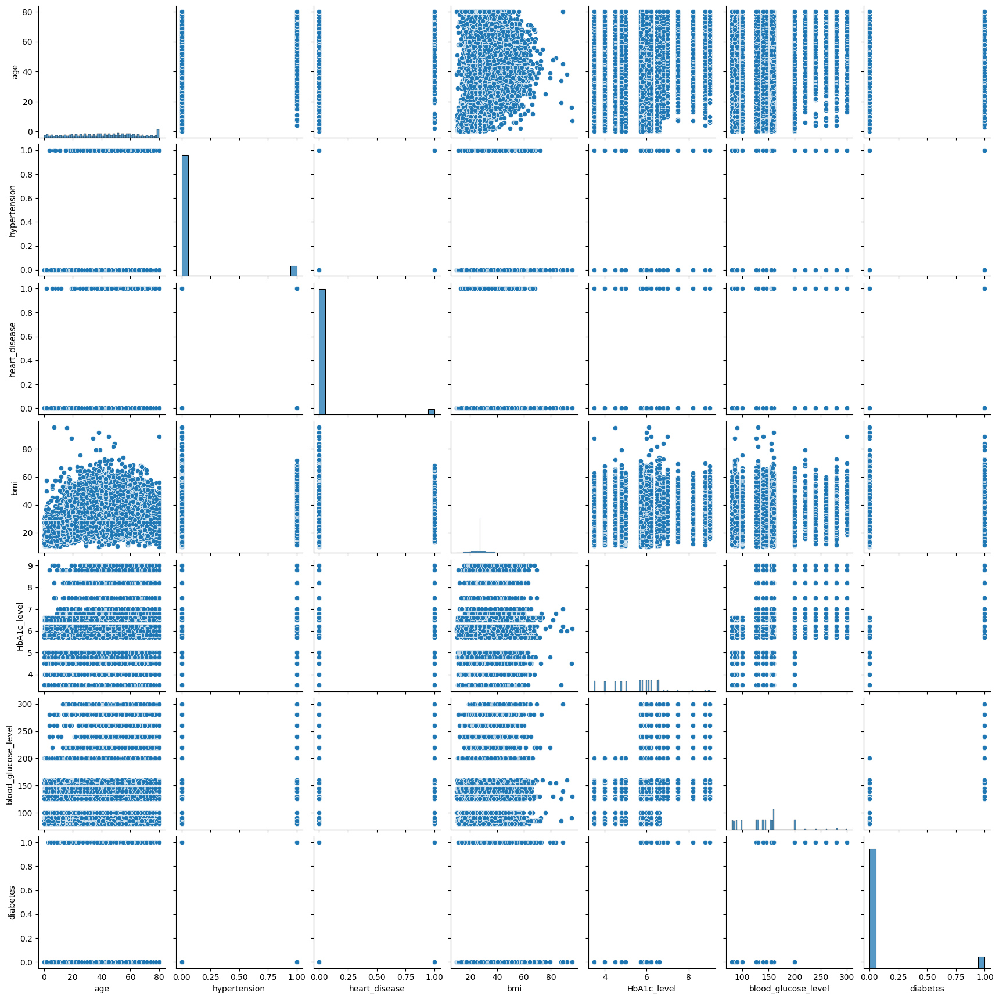

# Diabetes Prediction Model

## Overview
This project focuses on developing an AI model to predict the likelihood of diabetes in patients based on various medical features. The model utilizes a dataset with key attributes like glucose levels, blood pressure, and BMI to assess the risk of diabetes.

## Project Structure

- **Dataset**: The dataset used in this project is a CSV file containing the following features:
gender,age,hypertension,heart_disease,smoking_history,bmi,HbA1c_level,blood_glucose_level,diabetes

## Visualizations

## Result 
